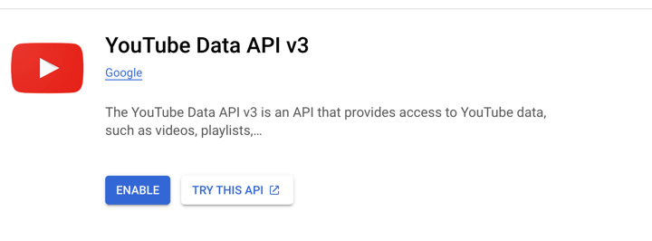
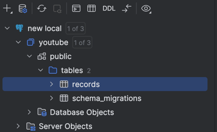
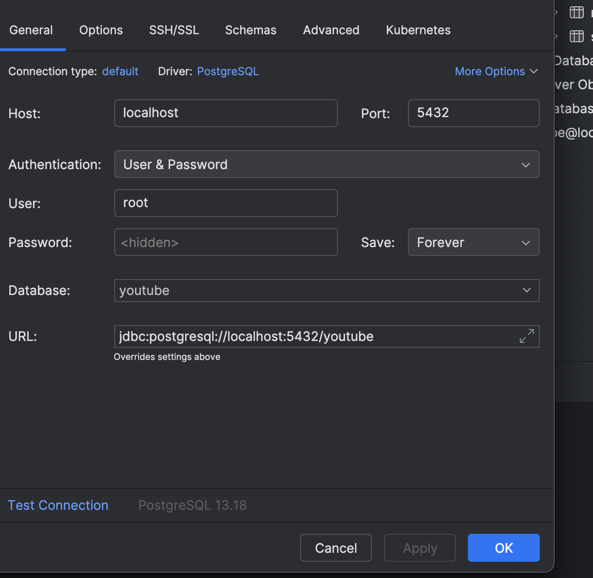

# Fam Youtube


## Table of Contents

- [Setup](#setup)
- [apis](#apis)

## setup
- Create a top-level directory to clone fam-youtube repository. 
- Open a terminal and run mkdir -p ~/go/src/github.com/rishusahu23
- Clone this repo inside rishusahu23(don't change the rishusahu23)
- Open the code in Goland.
- Open the link and create new project https://console.cloud.google.com/projectselector2/apis/credentials?pli=1&supportedpurview=project
- Create one api credential `AIzaSyChFVOhr9NDn****************` looks similar to this
- Paste this key in `ApiKeys` array in `test.yml`. Looks like ApiKeys: ["AIzaSyDmIAVUiZwiLGVgIidFCDKPq*************"]
- Click on Enabled Apis and services in present in shared above link. And search for youtube api open it, and Click on Enable on that page.
  https://console.cloud.google.com/marketplace/product/google/youtube.googleapis.com?q=search&referrer=search&project=serene-voltage-448721-e3&supportedpurview=project

- Download docker and start the docker.
- Run `docker-compose up --build`
- Once server start. It will look like 
- 
- Add postgres datasource.
- 
- Add these in properties for datasource.
- 

## apis
- This curl will be used to fetch data from youtube google api. Do not need to trigger this, it will be called automatically from server every 10 seconds. I am using grpc+protobuf.
  
`curl --location --request POST 'http://localhost:9090/api/v1/trigger-job'
  `

- This curl is used to get paginated response add page size which is limit and after_token which is empty for first time for second copy after_token in request from response of first one 

```
curl --location 'http://localhost:9090/api/v1/get-paginated-records' \
--header 'Content-Type: application/json' \
--data '{
    "page_context": {
        "page_size": 1,
        "after_token":""
    }
}'
```

```
curl --location 'http://localhost:9090/api/v1/get-paginated-records' \
--header 'Content-Type: application/json' \
--data '{
    "page_context": {
        "page_size": 1,
        "after_token":"eyJUaW1lc3RhbXAiOnsic2Vjb25kcyI6MTczNzU2ODU3OX0sIk9mZnNldCI6MSwiSXNSZXZlcnNlIjpmYWxzZX0="
    }
}'
```


-  This curl will return the videos on the basis of title and description.
if title or description is empty it will be ignored.
It will do full text search and case should match.
Copy the title and description from db itself.
Generate url from `main/main.go`
by copying title and description, generating url is necessary else it won't work.

```
curl --location 'http://localhost:9090/api/v1/records?description=Watch+the+thrilling+live+cricket+match+between+Durban+Super+Giants+vs+Paarl+Royals+with+expert+commentary+and+real-time+score+...&title=%F0%9F%94%A5SA20+Live%3A+Durban+vs+Paarl+%7C+18th+Match+%7C+Live+Cricket+Score+%26amp%3B+Commentary' \
--header 'Content-Type: application/json' \
--data ''
```

- GetPartialMatchRecords is Optimise version of GetFilteredRecords search api, so that it's able to search videos containing partial match for the search query in either video title or description.
Ex 1: A video with title `*How to make tea?*` should match for the search query `tea how`
- Generate url from `main/partial_match/main.go` file
```
curl --location --request GET 'http://localhost:9090/api/v1/partial-match/records?query=Durban+paarl' \
--header 'Content-Type: application/json' \
--data '{
    "page_context": {
        "page_size": 5,
        "after_token": "eyJUaW1lc3RhbXAiOnsic2Vjb25kcyI6MTczNzQ4MjE3OX0sIk9mZnNldCI6NSwiSXNSZXZlcnNlIjpmYWxzZX0="
            }
}'
```